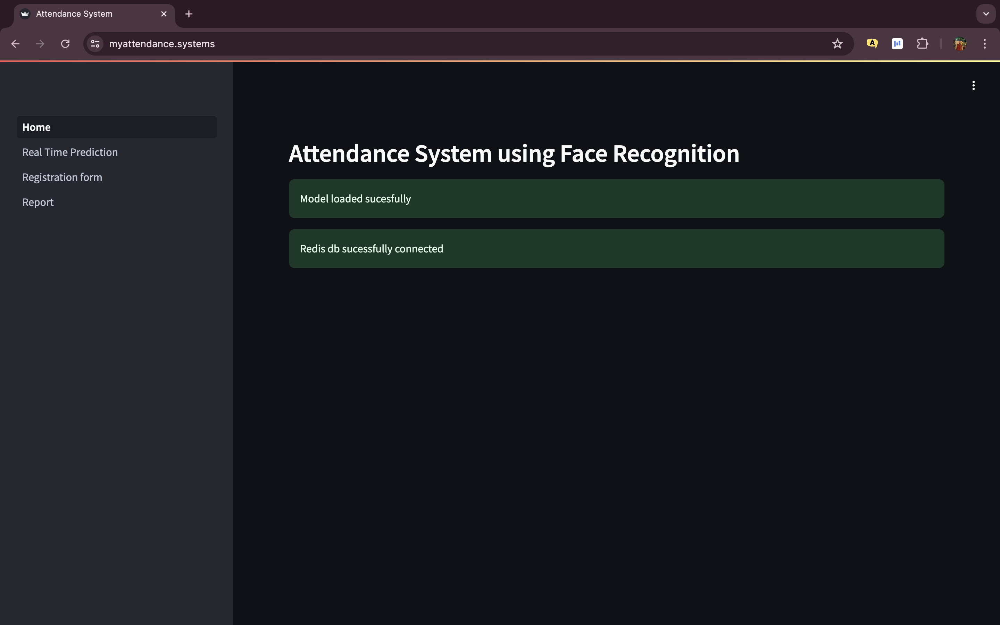
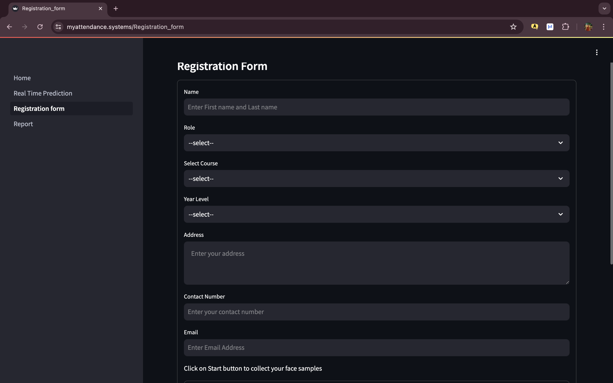
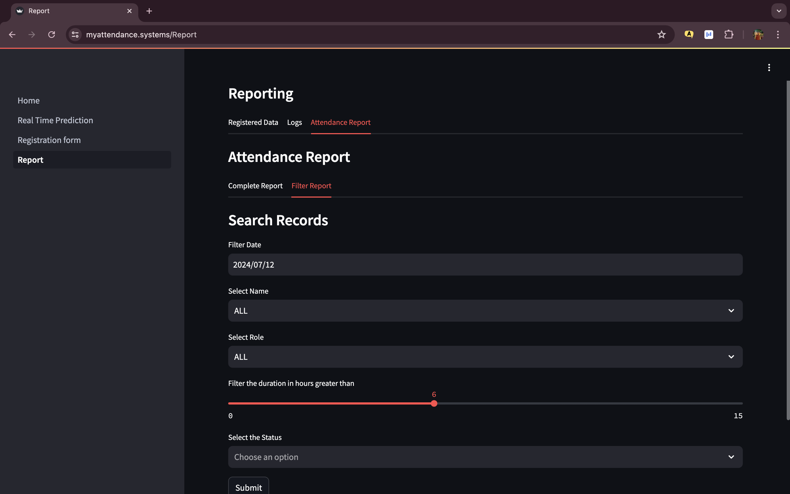

# 🎯 AWS AI-Based Smart Attendance System

**A serverless, facial-recognition-powered attendance platform built on AWS — Rekognition, Lambda, S3, SNS, RDS, and CloudWatch working together to replace manual roll-call with instant, automated check-ins.**

[](https://www.python.org/)
[](https://streamlit.io/)
[](https://aws.amazon.com/)
[](https://opencv.org/)
[]()

---

## 📖 Overview

Manual roll-call attendance is slow, error-prone, and easy to game. This project replaces it with an **automated, facial-recognition-driven attendance system** architected around AWS managed services for a scalable, serverless deployment.

The system detects and recognizes registered faces in real time, logs attendance instantly, and pushes live notifications the moment a check-in is recorded — all through a clean Streamlit dashboard.

- **Amazon Rekognition** handles scalable, managed facial recognition
- **AWS Lambda** orchestrates a serverless recognition-to-logging pipeline
- **Amazon S3** stores registered face images and captured frames
- **Amazon RDS** persists attendance records for reporting
- **Amazon SNS** delivers real-time check-in notifications
- **CloudWatch + IAM** handle observability and least-privilege access control

> 💡 **Local mode included:** a zero-dependency local build (InsightFace + OpenCV, no AWS account required) is also available for fast iteration and offline demos.

---

## ✨ Key Features

### 🖥️ Face Detection & Recognition
- Real-time face detection and recognition powered by **InsightFace**
- **OpenCV**-based image and video pipeline
- Automated, instant attendance logging on recognition
- Local fallback storage when a live data store isn't available

### 📝 Registration & Reporting
- Guided face-registration workflow for onboarding new users
- Attendance record management and historical reports
- Simulated data mode for testing and demos

### 🌐 Streamlit Web Interface
- **Home / Dashboard** — system overview and navigation
- **Real-Time Prediction** — live recognition and check-in
- **Registration Form** — enroll new faces
- **Reports** — view and export attendance history

### 🔐 Authentication & Security
- Username/password application authentication
- Password hashing for credential storage
- Environment-variable-based configuration — no hard-coded secrets
- `.gitignore`-protected local configuration files

### ☁️ Cloud-Ready Architecture (AWS)
- **Amazon Rekognition** for scalable facial recognition
- **AWS Lambda** for a serverless processing pipeline
- **Amazon S3** for image/data storage
- **Amazon SNS** for real-time attendance notifications
- **Amazon RDS** for durable, queryable attendance records
- **Amazon CloudWatch** for monitoring and logging
- **IAM** for least-privilege access control

---

## 🛠️ Tech Stack

| Layer | Technology |
|---|---|
| Language | Python |
| Web Interface | Streamlit |
| Face Recognition | InsightFace |
| Image/Video Processing | OpenCV |
| Data Processing | NumPy, Pandas |
| Caching / Data Store | Redis (optional), Pickle (local fallback) |
| Cloud Services | AWS Rekognition, S3, Lambda, SNS, RDS, CloudWatch, IAM |

---

## 📸 Screenshots

| Dashboard | Real-Time Recognition |
|---|---|
|  |  |
| Model and database health checks on load | Live face-embedding table pulled from Redis, ready for recognition |

| Registration | Attendance Logs |
|---|---|
|  |  |
| Face-sample enrollment with role, course, and contact details | Raw check-in event log with per-user timestamps |

| Attendance Report | Filter Report |
|---|---|
|  |  |
| Consolidated in/out times, duration, and status per user | Query attendance by date, name, role, and duration threshold |

> Screenshots are stored in the [`Screenshots/`](./Screenshots) directory.

---

## 🚀 Getting Started (Local Setup — Windows)

### Requirements
- Windows 10 or Windows 11
- Python 3.x
- Git
- A modern web browser

### 1. Clone the repository
```bash
git clone https://github.com/MusaibParvez07/AWS-AI-Based-Smart-Attendance-System.git
cd AWS-AI-Based-Smart-Attendance-System
```

### 2. Create and activate a virtual environment
```bash
python -m venv venv
venv\Scripts\activate
```

### 3. Install dependencies
```bash
python -m pip install -r requirements.txt
```

### 4. Run the app
```bash
python -m streamlit run Home.py
```

Then open **http://localhost:8501** in your browser.

> No AWS account or paid cloud service is required to run the local version — Redis and AWS are optional enhancements, not prerequisites.

---

## ☁️ AWS Architecture

The AWS integration is wired through `aws_helper.py`, `aws_config.example.json`, and `configure.sh`, connecting each service into a single serverless pipeline:

```
Camera Frame → Lambda → Rekognition (match) → RDS (log) → SNS (notify)
                              │
                              ▼
                        S3 (face store)
```

AWS credentials are never committed to the repo — configuration is handled entirely through environment variables and `.gitignore`-excluded local files.

---

## 📁 Project Structure

```
AWS-AI-Based-Smart-Attendance-System/
├── .streamlit/
│   └── config.toml
├── assets/
│   ├── style.css
│   └── tech_bg.png
├── insightface_model/
│   └── models/buffalo_sc/
├── pages/
│   ├── 1_Real_Time_Prediction.py
│   ├── 2_Registration_form.py
│   └── 3_Report.py
├── Screenshots/
├── Home.py
├── auth.py
├── aws_config.example.json
├── aws_helper.py
├── aws_test.py
├── check_rds.py
├── config.yaml
├── configure.sh
├── face_rec.py
├── main.sh
├── requirements.txt
└── README.md
```

---

## 🔭 Roadmap

- [ ] Improved face recognition accuracy under varied lighting/angles
- [ ] Real-time camera pipeline optimization
- [ ] Enhanced attendance analytics dashboard
- [ ] Exportable attendance reports (CSV/PDF)
- [ ] Multi-user / role-based administration
- [ ] Full managed-database (RDS) integration
- [ ] End-to-end AWS deployment guide

---


---

⭐ If you find this project useful, consider giving it a star!
