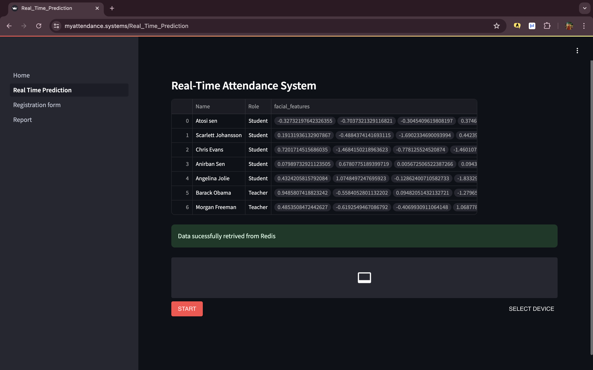
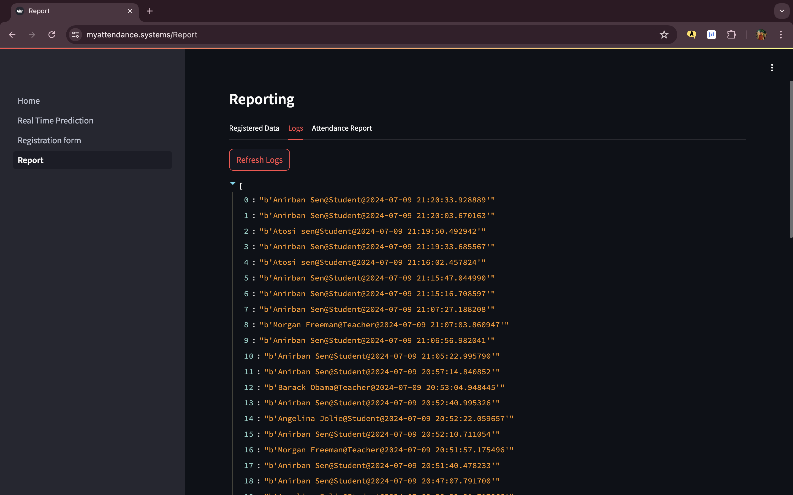
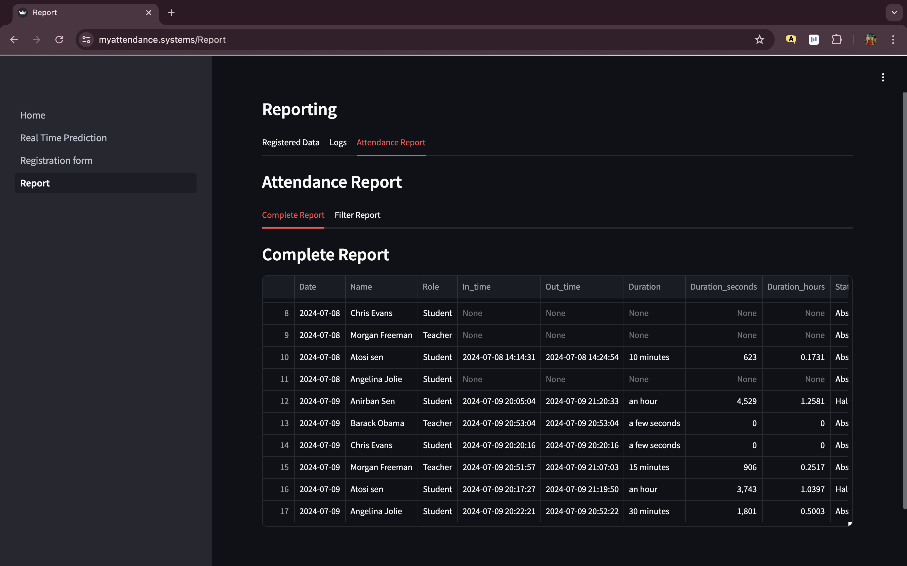

# AWS AI Based Smart Attendance System

A Python and Streamlit-based face recognition attendance system that automates attendance tracking using facial recognition, local data storage, and real-time processing.

The project was originally designed with AWS deployment and cloud components in mind, but the current version is configured and tested as a **local Windows application**. No AWS account or paid cloud services are required to run the current version.

## Features

### 🖥️ Face Detection and Recognition

* Face detection and recognition using InsightFace
* OpenCV-based image and video processing
* Real-time face recognition
* Automated attendance recording
* Local fallback storage when Redis is unavailable

### 📝 Registration and Reporting

* Face registration workflow
* Attendance record management
* Attendance reports
* Simulated attendance data for testing
* Recognition accuracy tested manually during development

### 🌐 Streamlit Web Interface

The application provides a Streamlit-based interface with separate pages for:

* Home / Dashboard
* Real-Time Prediction
* Registration Form
* Reports

### 🔐 Authentication

* Application authentication
* Username/password-based access
* Password hashing
* Protected application functionality

## Technology Stack

| Technology  | Purpose                          |
| ----------- | -------------------------------- |
| Python      | Application development          |
| Streamlit   | Web interface                    |
| InsightFace | Face detection and recognition   |
| OpenCV      | Image and video processing       |
| NumPy       | Numerical processing             |
| Pandas      | Data processing                  |
| Redis       | Optional attendance data storage |
| Pickle      | Local fallback data storage      |

## Project Structure

```text
Cloud-Smart-Attendance-System/
├── .streamlit/
│   └── config.toml
├── assets/
│   ├── style.css
│   └── tech_bg.png
├── insightface_model/
│   └── models/
│       └── buffalo_sc/
├── pages/
│   ├── 1_Real_Time_Prediction.py
│   ├── 2_Registration_form.py
│   └── 3_Report.py
├── Screenshots/
├── Home.py
├── auth.py
├── aws_config.example.json
├── aws_helper.py
├── aws_test.py
├── check_rds.py
├── config.yaml
├── configure.sh
├── face_rec.py
├── main.sh
├── requirements.txt
├── simulated_logs.txt
└── README.md
```

## Windows Local Setup

### Requirements

* Windows 10 or Windows 11
* Python 3.x
* Git
* A modern web browser

### 1. Clone the Repository

```cmd
git clone https://github.com/MusaibParvez07/AWS-AI-Based-Smart-Attendance-System.git
```

Then enter the project directory:

```cmd
cd AWS-AI-Based-Smart-Attendance-System
```

### 2. Create a Virtual Environment

```cmd
python -m venv venv
```

### 3. Activate the Virtual Environment

```cmd
venv\Scripts\activate
```

### 4. Install Dependencies

```cmd
python -m pip install -r requirements.txt
```

### 5. Start the Application

```cmd
python -m streamlit run Home.py
```

Open the application in a browser:

```text
http://localhost:8501
```

## Running the Existing Windows Setup

If the dependencies have already been installed in an existing virtual environment, activate that environment and start Streamlit:

```cmd
cd C:\Users\hp\Documents\Projects\Cloud-Smart-Attendance-System
C:\Users\hp\venv\Scripts\activate
python -m streamlit run Home.py
```

## Application Pages

### Home

Provides the main application interface and navigation.

### Real-Time Prediction

Uses the face recognition system to identify registered faces and record attendance.

### Registration Form

Allows users to register facial information for attendance recognition.

### Report

Displays attendance information and reporting data.

## Redis

Redis is supported as an optional data store.

The application first attempts to connect to a local Redis instance and can optionally use a remote Redis configuration.

If Redis is unavailable, the application uses the local fallback storage mechanism included in the project.

**Redis and AWS are not required for the current basic local Windows setup.**

## AWS

The project contains AWS-related helper and configuration files because the original project was designed with cloud deployment in mind.

The current repository does **not require AWS services to run the application locally**.

No AWS account, EC2 instance, RDS database, Route 53 configuration, or paid AWS service is required for the local version.

## Security

* AWS credentials are not included in the repository.
* Sensitive configuration should be stored locally.
* `.gitignore` is used to prevent local configuration files from being committed.
* Database/cloud credentials should never be hard-coded.
* The project uses configuration/environment variables for optional remote services.

## Screenshots

Screenshots of the application interface are available in:

```text
Screenshots/
```
📸  Home Page 
📸  Attendance Page  
📸  Registration Page 
📸  Report Page
📸 
📸 

## Project Status

**Status: Completed and locally tested on Windows.**

The current version is intended as a **local demonstration and portfolio project**.

The application has been tested locally with:

* Face recognition
* Registration
* Attendance processing
* Streamlit interface
* Reports
* Local fallback storage

## Future Improvements

Possible future improvements include:

* Improved face recognition accuracy
* Real-time camera optimization
* Enhanced attendance analytics
* Exportable attendance reports
* Multi-user administration
* Optional cloud deployment
* Optional managed database integration
* Improved API and documentation
